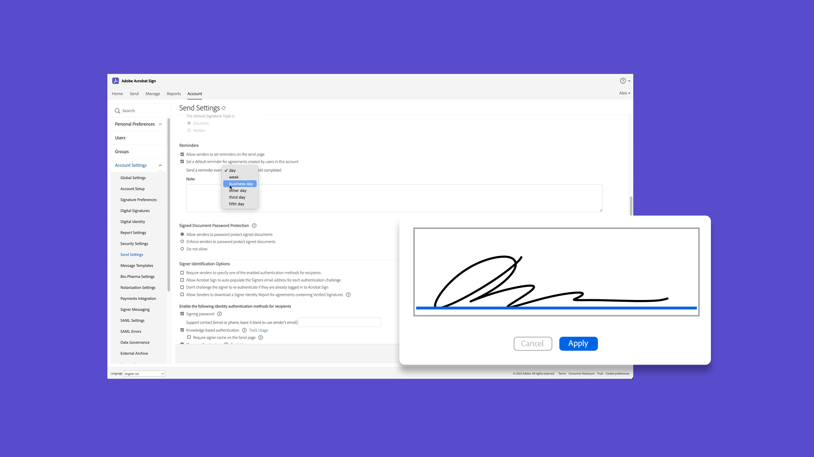
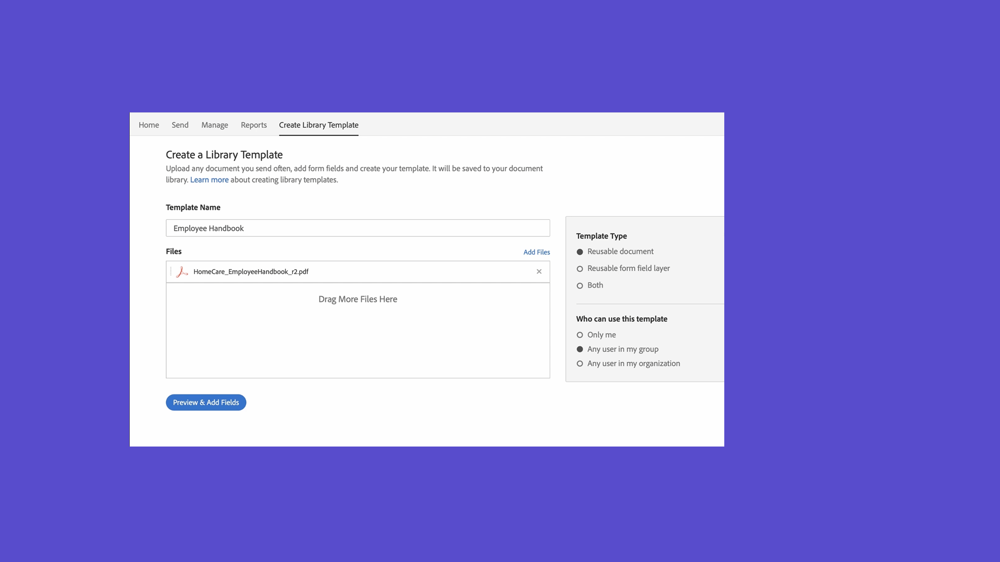

# Übersicht über die ersten Schritte

Erfahre in diesen kurzen Schritt-für-Schritt-Tutorials, wie du Dokumente versendest, unterschreibst und nachverfolgst. Verschaffen Sie sich einen Überblick über Acrobat Sign, und versenden Sie dann ein Dokument an eine oder mehrere Personen. Dieser Inhalt wurde entwickelt, um Ihnen den Einstieg in E-Signatur-Workflows zu erleichtern.

## Neue Funktionen

>[!BEGINTABS]

>[!TAB Verwendung von Kopie erstellen]

Erfahren Sie, wie Sie mit [Kopie erstellen](../sign-beginner-tutorials/create-a-copy.md) eine vorhandene Vereinbarung duplizieren. Du kannst schnell anpassen, was geändert werden muss, und das Dokument in Sekunden erneut versenden. Keine Wiederherstellung von Grund auf.

>[!TAB Dokument nach dem Senden ändern]

Erfahren Sie, wie [ein Dokument &#x200B;](../sign-beginner-tutorials/manage-and-track.md) ändern kann, das bereits zur Signatur gesendet wurde.

>[!TAB Vereinbarungen verwalten und verfolgen]

Erfahren Sie, wie [Vereinbarungen verwalten und verfolgen](../sign-beginner-tutorials/manage-and-track.md), die zur Signatur gesendet wurden.

>[!TAB Ein Dokument elektronisch signieren]

Erfahren Sie, wie einfach es ist, ein Dokument, das Ihnen mit Acrobat Sign gesendet wurde, [zu signieren](../sign-beginner-tutorials/electronically-sign-a-document.md).

>[!ENDTABS]

## Send

<table style="table-layout:fixed">
<tr>
  <td>
    
    

    <a href="new-sender.md"><strong>Erste Schritte mit Acrobat Sign</strong></a>
    

    Dieses Tutorial ist ein guter Ausgangspunkt für neue Benutzende in Acrobat Sign
     
  </td>
 <td>
    
    

    <a href="quick-tour.md"><strong>Grundlagen des Arbeitsbereichs</strong></a>
    

    Sehen Sie sich kurz den Arbeitsbereich von Acrobat Sign an, um mit der Arbeit zu beginnen
     
  </td>
  <td>
    
    

    <a href="send-to-single-recipient.md"><strong>Ein Dokument an einen einzelnen Unterzeichner senden</strong></a>
    

    Erfahre, wie einfach es ist, ein Dokument zur Signatur zu versenden
     
  </td>
  <td>
    
    

    <a href="send-to-multiple-recipients.md"><strong>An mehrere Unterzeichner senden</strong></a>
    

    Sende ein Dokument zur elektronischen Signatur an mehrere Leute in genau der gewünschten Reihenfolge
     
  </td>
</tr>
<tr>
  <td>
    
    

    <a href="sending-options.md"><strong>Sendeoptionen konfigurieren</strong></a>
    

    Erfahre, wie du beim Versenden eines Dokuments zur Signatur verschiedene Optionen konfigurierst
     
  </td>
  <td>
    
    

    <a href="adding-fields.md"><strong>Hinzufügen von Feldern zu Ihren Dokumenten</strong></a>
    

    Erfahren Sie, wie Sie Ihren Dokumenten verschiedene Feldtypen hinzufügen.
     
  </td>
  <td>
    
    

    <a href="modify-in-flight.md"><strong>Dokument nach dem Senden ändern</strong></a>
    

    Erfahren Sie, wie Sie ein Dokument ändern, das bereits in Bearbeitung ist.
     
  </td>
  <td>
    
    

    <a href="replace-signer.md"><strong>Unterzeichner ersetzen</strong></a>
    

    Erfahren Sie, wie Sie den Unterzeichner eines Dokuments ändern, das bereits in Bearbeitung ist
      
  </td>
</tr>
<tr>
  <td>
      
      

      <a href="set-deadlines-reminders.md"><strong>Termine und Erinnerungen festlegen</strong></a>
      

      Erfahren Sie, wie Sie regelmäßige E-Mail-Erinnerungen und Fristen senden, um Ihre Dokumente schnell signieren zu lassen
       
    </td> 
  <td>
    
    

    <a href="../sign-advanced-users/create-a-template.md"><strong>Wiederverwendbare Vorlage erstellen</strong></a>
    

    Erstelle eine wiederverwendbare Dokumentvorlage, um deinem Unternehmen eine schnelle und einheitliche Arbeitsweise zu ermöglichen
     
  </td>
  <td>
     
    

    <a href="checkbox-groups.md"><strong>Erforderliche Auswahlen mit Kontrollkästchengruppen anzeigen</strong></a>
    

    Erfahren Sie, wie Sie Kontrollkästchengruppen verwenden, um zu steuern, wie viele Optionen ein Unterzeichner in einem Formular auswählen kann.
     
    </td>
  <td>
     
    

    <a href="create-a-copy.md"><strong>Verwendung von Kopie erstellen</strong></a>
    

    Hier erfahren Sie, wie Sie eine Kopie erstellen verwenden, um eine vorhandene Vereinbarung zu duplizieren.
     
    </td>
</tr>
</table>

## Unterschreiben

<table style="table-layout:fixed">
<tr>
  <td>
    
    

    <a href="electronically-sign-a-document.md"><strong>Ein Dokument elektronisch signieren</strong></a>
    

    Erfahre, wie einfach es ist, ein Dokument zu signieren, das dir mit Acrobat Sign zugesendet wird
     
  </td>
  <td>
    
    

    <a href="fill-and-sign.md"><strong>Ein Dokument ausfüllen und signieren</strong></a>
    

    Formulare ausfüllen und Dokumente mit deiner elektronischen Signatur versehen
     
  </td>
  <td>
    
    

    <a href="sign-in-person.md"><strong>Persönliche Signatur erhalten</strong></a>
    

    Unterschrift einer anderen Person über die mobile Acrobat Sign-App einholen
     
  </td>
  <td>
    
    

    <a href="delegate-signing.md"><strong>Unterschrift an eine andere Person delegieren</strong></a>
    

    Erfahren Sie, wie Sie die Unterzeichnung eines Dokuments an eine andere Person delegieren.
     
  </td>
</tr>
<tr>
  <td>
    
    

    <a href="sign-with-a-digital-signature.md"><strong>Was ist eine digitale Signatur</strong></a>
    

    Weitere Informationen zu zertifikatbasierten digitalen Signaturen
     
  </td>
  <td>
    
    

    <a href="sign-with-a-stamp.md"><strong>Signieren mit einem Stempel</strong></a>
    

    Dokumente mit Stempeln als genehmigt oder abgeschlossen markieren
      
  </td> 
 <td>
    
    

     
  </td>
  <td>
    
    

     
  </td>
</tr>  
</table>

## Verwalten

<table style="table-layout:fixed">
<tr>
  <td>
    
    

    <a href="manage-and-track.md"><strong>Vereinbarungen verwalten und verfolgen</strong></a>
    

    Erfahre, wie du zur Signatur versendete Vereinbarungen verwaltest und nachverfolgst
     
  </td>
  <td>
    
    

     
  </td>
  <td>
    
    

     
  </td>
  <td>
    
    

     
  </td>
</tr>
</table>
