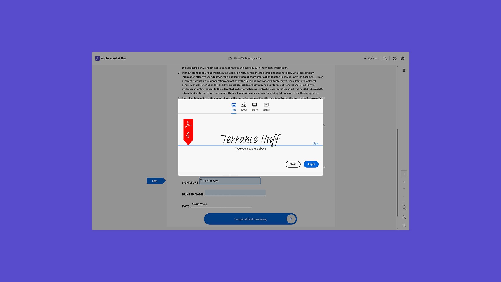
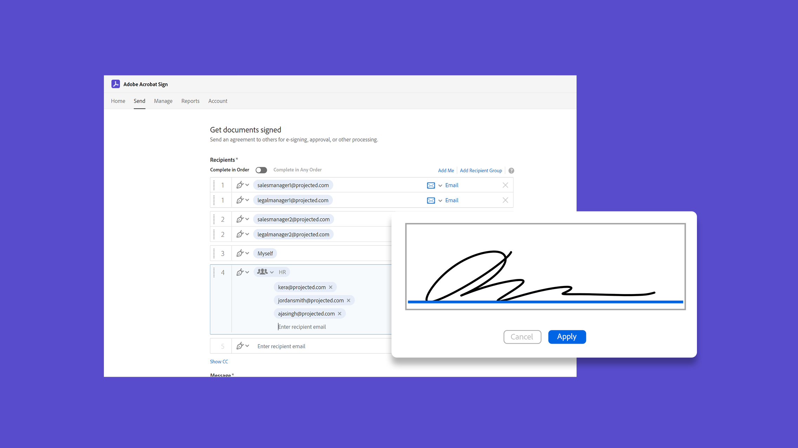
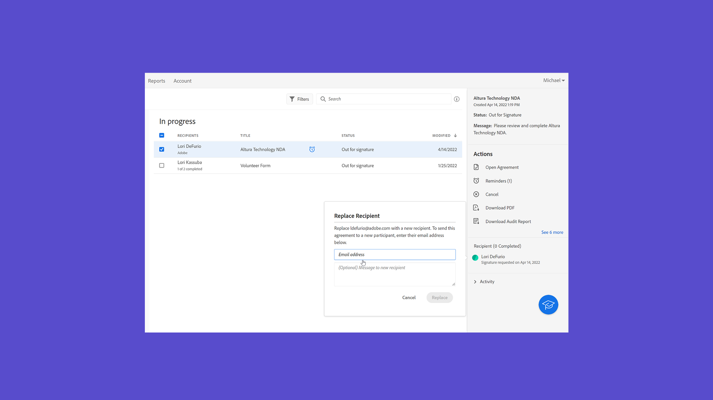
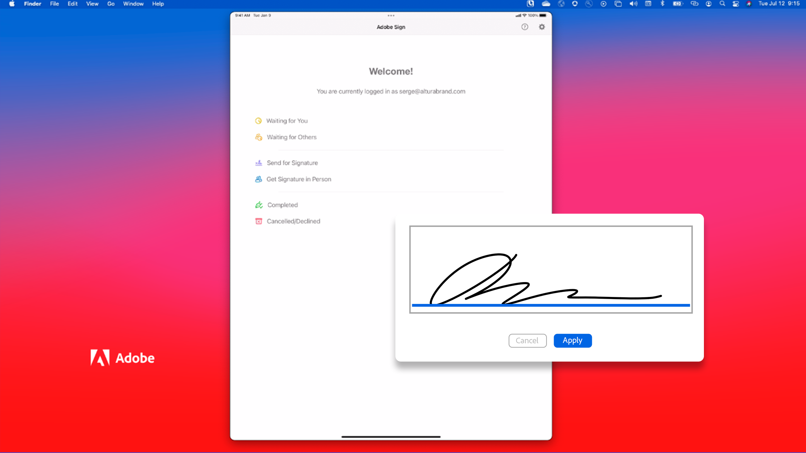

# Übersicht über die ersten Schritte

Erfahre in diesen kurzen Schritt-für-Schritt-Tutorials, wie du Dokumente versendest, unterschreibst und nachverfolgst. Verschaffen Sie sich einen Überblick über Acrobat Sign, und versenden Sie dann ein Dokument an eine oder mehrere Personen. Dieser Inhalt wurde entwickelt, um Ihnen den Einstieg in E-Signatur-Workflows zu erleichtern.

## Neue Funktionen

>[!BEGINTABS]

>[!TAB Wiederverwendbare Vorlage erstellen]

Erfahren Sie, wie Sie eine [wiederverwendbare Dokumentvorlage](../sign-advanced-users/create-a-template.md) erstellen.

>[!TAB Sendeoptionen konfigurieren]

Erfahren Sie, wie Sie [verschiedene Optionen](sending-options.md) konfigurieren, wenn Sie ein Dokument zur Signatur senden.

>[!TAB An mehrere Unterzeichner senden]

Erfahren Sie, wie Sie ein Dokument in genau der gewünschten Reihenfolge zur elektronischen Signatur an [mehrere Personen](send-to-multiple-recipients.md) senden.

>[!TAB Ein Dokument an einen einzelnen Unterzeichner senden]

Springen Sie ein und erfahren Sie, wie einfach es ist, ein Dokument [zur Signatur zu senden](send-to-single-recipient.md).

>[!TAB Erste Schritte mit Acrobat Sign]

Verwenden Sie Acrobat Sign zum ersten Mal? Dieses [Tutorial](new-sender.md) ist ein guter Ausgangspunkt.

>[!ENDTABS]

## Send

<table style="table-layout:fixed">
<tr>
  <td>
    
    

    <a href="new-sender.md"><strong>Erste Schritte mit Acrobat Sign</strong></a>
    

    Dieses Tutorial ist ein guter Einstieg für Einsteiger in Acrobat Sign.
     
  </td>
 <td>
    
    

    <a href="quick-tour.md"><strong>Grundlagen des Arbeitsbereichs</strong></a>
    

    Sehen Sie sich kurz den Arbeitsbereich von Acrobat Sign an, um mit der Arbeit zu beginnen
     
  </td>
  <td>
    
    

    <a href="send-to-single-recipient.md"><strong>Ein Dokument an einen einzelnen Unterzeichner senden</strong></a>
    

    Erfahre, wie einfach du Dokumente zur Unterzeichnung versenden kannst.
     
  </td>
  <td>
    
    

    <a href="send-to-multiple-recipients.md"><strong>An mehrere Unterzeichner senden</strong></a>
    

    Dokumente an mehrere Empfänger in der gewünschten Reihenfolge senden
     
  </td>
</tr>
<tr>
  <td>
    
    

    <a href="sending-options.md"><strong>Sendeoptionen konfigurieren</strong></a>
    

    Erfahren Sie, wie Sie verschiedene Optionen konfigurieren, wenn Sie ein Dokument zur Signatur senden
     
  </td>
  <td>
    
    

    <a href="adding-fields.md"><strong>Hinzufügen von Feldern zu Ihren Dokumenten</strong></a>
    

    Erfahren Sie, wie Sie Ihren Dokumenten verschiedene Feldtypen hinzufügen.
     
  </td>
  <td>
    
    

    <a href="modify-in-flight.md"><strong>Ändern eines Dokuments nach dem Senden</strong></a>
    

    Ändern von Dokumenten, die bereits in Bearbeitung sind
     
  </td>
  <td>
    
    

    <a href="replace-signer.md"><strong>Unterzeichner ersetzen</strong></a>
    

    Erfahren Sie, wie Sie den Unterzeichner eines Dokuments ändern, das bereits in Bearbeitung ist
      
  </td>
</tr>
<tr>
  <td>
      
      

      <a href="set-deadlines-reminders.md"><strong>Termine und Erinnerungen festlegen</strong></a>
      

      Erfahren Sie, wie Sie regelmäßige E-Mail-Erinnerungen und Fristen senden, um Ihre Dokumente schnell signieren zu lassen
       
    </td> 
  <td>
    
    

    <a href="../sign-advanced-users/create-a-template.md"><strong>Wiederverwendbare Vorlage erstellen</strong></a>
    

    Wiederverwendbare Dokumentvorlagen erstellen, um Ihrem Unternehmen Geschwindigkeit und Konsistenz zu verleihen
     
  </td>
    <td>
      
      

       
    </td>
    <td>
      
      

       
    </td>
</tr>
</table>

## Unterschreiben

<table style="table-layout:fixed">
<tr>
  <td>
    
    

    <a href="electronically-sign-a-document.md"><strong>Elektronisches Signieren eines Dokuments</strong></a>
    

    Erfahren Sie, wie einfach es ist, ein Dokument zu unterschreiben, das Ihnen mit Acrobat Sign gesendet wird
     
  </td>
  <td>
    
    

    <a href="fill-and-sign.md"><strong>Ein Dokument ausfüllen und signieren</strong></a>
    

    Formulare ausfüllen und Dokumente mit deiner elektronischen Signatur versehen
     
  </td>
  <td>
    
    

    <a href="sign-in-person.md"><strong>Persönliche Signatur erhalten</strong></a>
    

    Unterschrift einer anderen Person über die mobile Acrobat Sign-App einholen
     
  </td>
  <td>
    
    

    <a href="delegate-signing.md"><strong>Unterschrift an eine andere Person delegieren</strong></a>
    

    Erfahren Sie, wie Sie die Unterzeichnung eines Dokuments an eine andere Person delegieren.
     
  </td>
</tr>
<tr>
  <td>
    
    

    <a href="sign-with-a-digital-signature.md"><strong>Was ist eine digitale Signatur</strong></a>
    

    Weitere Informationen zu zertifikatbasierten digitalen Signaturen
     
  </td>
  <td>
    
    

    <a href="sign-with-a-stamp.md"><strong>Signieren mit einem Stempel</strong></a>
    

    Dokumente mit Stempeln als genehmigt oder abgeschlossen markieren
      
  </td> 
 <td>
    
    

     
  </td>
  <td>
    
    

     
  </td>
</tr>  
</table>

## Verwalten

<table style="table-layout:fixed">
<tr>
  <td>
    
    

    <a href="manage-and-track.md"><strong>Vereinbarungen verwalten und verfolgen</strong></a>
    

    Hier erfahren Sie, wie Sie zum Unterschreiben gesendete Vereinbarungen verwalten und verfolgen.
     
  </td>
  <td>
    
    

     
  </td>
  <td>
    
    

     
  </td>
  <td>
    
    

     
  </td>
</tr>
</table>
