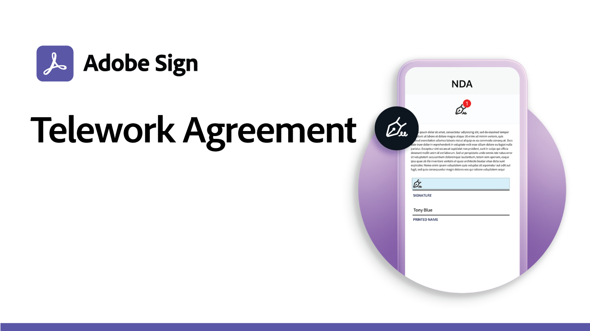
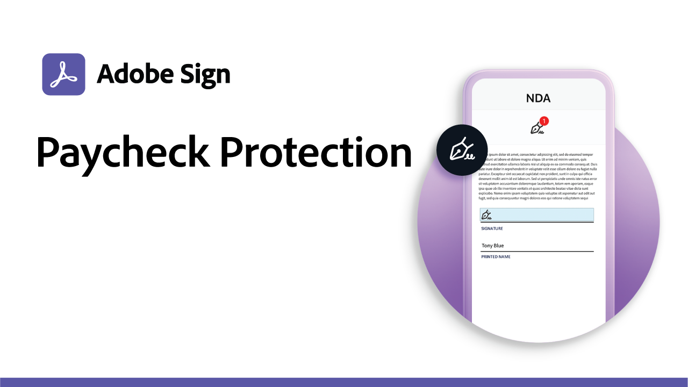

# Nutzungsszenarien

Beschleunigt die digitalen Workflows in eurem Unternehmen mit diesen Beispielen für elektronische Unterschriften von Behörden und Unternehmen. Klicken Sie hier, um eine PDF mit Ressourcen und Details zum Einrichten dieser spezifischen Anwendungsfälle für elektronische Signaturen anzuzeigen.

## Nutzungsszenarien in Regierungseinrichtungen

<table style="table-layout:fixed">
<tr>
  <td>
    
    

    <a href="usecasegovgrants.md"><strong>Unternehmenszuschüsse und -darlehen</strong></a>
    

    <em>Bieten Sie Unternehmen schnelle Unterstützung, indem Sie Selfservice-Zugriff auf Antragsformulare für Zuschüsse, Darlehen und Steuerstundung gewähren</em>
     
  </td> 
  <td>
    
    

    <a href="usecasegovtelework.md"><strong>Telearbeit</strong></a>
    

    <em>Hole Unterschriften aller Mitarbeiter ein, die du für Dokumente zur Telearbeit oder Richtlinien benötigst.</em>
     
  </td>
  <td>
    
    

    <a href="usecasegovcontracts.md"><strong>Verträge und Anforderungsformulare</strong></a>
    

    <em>Ersetzen Sie die Papierverarbeitung schnell durch standardkonforme digitale Workflows mit Prüfberichten</em>
     
  </td>
</tr>
<tr>
  <td>
    
    

    <a href="usecasegovreemployment.md"><strong>Beschäftigungsbeihilfe</strong></a>
    

    <em>Helft Bürgern, die benötigte Hilfe zu erhalten, ohne mit Formularen für vollständig digitale Anträge in Kontakt zu stehen, die in wenigen Tagen ausgefüllt werden können</em>
     
  </td>
  <td>
    
    

    <a href="usecasegovpaycheck.md"><strong>Gehaltsscheckschutz</strong></a>
    

    <em>Erfahren Sie, wie Sie mit Acrobat Sign das Formular für das Paycheck Protection Program in ein interaktives Online-Formular umwandeln können.</em>
     
  </td>
  <td>
    
    

    <a href="usecasegovremote.md"><strong>Remote-Warrant-Anfrage</strong></a>
    

    <em>Verwendet elektronische Unterschriften und Web-Konferenzen zusammen, um die Beantragung und Sicherung von Haftbefehlen durch Richter zu beschleunigen</em>
     
  </td>
</tr>
</table>

## Nutzungsszenarien

<table style="table-layout:fixed">
<tr>
  <td>
    
    

    <a href="usecasecomcontracts.md"><strong>Verträge und Anforderungsformulare</strong></a>
    

    <em>Ersetzen Sie die Papierverarbeitung schnell durch standardkonforme digitale Workflows mit Prüfberichten</em>
     
  </td> 
  <td>
    
    

    <a href="usecasecompolicy.md"><strong>Richtlinienvereinbarungen</strong></a>
    

    <em>Unterschriften aller Mitarbeiter effizient einholen, wenn Richtlinienvereinbarungen und Aktualisierungen umgesetzt werden</em>
     
  </td>
  <td>
    
    

    <a href="usecasecomtelework.md"><strong>Telearbeit</strong></a>
    

    <em>Alle Mitarbeiter über Telearbeit informieren und Unterschriften einholen</em>
     
  </td>
</tr>
</table>
