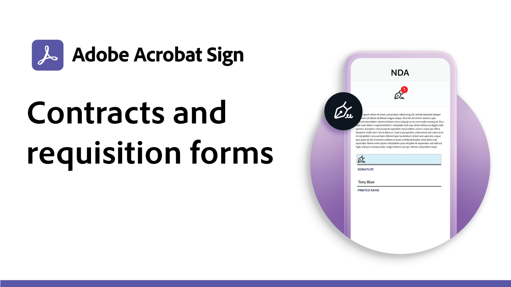

# Fallrezepte verwenden

Beschleunigen Sie die digitalen Workflows Ihres Unternehmens mit diesen Beispielen für behördliche und kommerzielle elektronische Unterschriften. Klicken Sie auf , um eine PDF-Datei mit Ressourcen und Details zum Einrichten dieser spezifischen Anwendungsfälle für elektronische Signaturen anzuzeigen.

## Anwendungsfälle für Behörden

<table style="table-layout:fixed">
<tr>
  <td>
    
    

    <a href="usecasegovgrants.md"><strong>Unternehmenszuschüsse und -darlehen</strong></a>
    

    <em>Schnelle Unterstützung für Unternehmen durch Bereitstellung von Formularen für Anträge auf Gewährung, Darlehen und Steueraufschub</em>
     
  </td> 
  <td>
    
    

    <a href="usecasegovtelework.md"><strong>Telearbeitvereinbarung</strong></a>
    

    <em>Signaturen von allen Mitarbeitern über Telearbeitsvereinbarungen, Richtlinien-Updates und mehr effizient erfassen</em>
     
  </td>
  <td>
    
    

    <a href="usecasegovcontracts.md"><strong>Verträge und Anforderungen Forms</strong></a>
    

    <em>Schnelles Ersetzen der Papierverarbeitung durch konforme digitale Arbeitsabläufe, einschließlich Prüfberichte</em>
     
  </td>
</tr>
<tr>
  <td>
    
    

    <a href="usecasegovreemployment.md"><strong>Unterstützung bei der Wiedereingliederung</strong></a>
    

    <em>Unterstützung der Bürger bei der Unterstützung, die sie benötigen, ohne sich an Formulare für digitale Anwendungen zu orientieren, die tagtäglich live genutzt werden können</em>
     
  </td>
  <td>
    
    

    <a href="usecasegovpaycheck.md"><strong>Zahlungsscheck</strong></a>
    

    <em>Erfahren Sie, wie Sie mit Adobe Sign das Formular für das Zahlungsschutzprogramm in ein interaktives Online-Formular umwandeln können.</em>
     
  </td>
  <td>
    
    

    <a href="usecasegovremote.md"><strong>Anforderung eines Remote-Haftbefehls</strong></a>
    

    <em>Durch die gemeinsame Nutzung elektronischer Signaturen und Webkonferenzen können Sie die Zeit verkürzen, die zum Anfordern und Sichern von Haftbefehlen von Richtern benötigt wird</em>
     
  </td>
</tr>
</table>

## Fälle kommerzieller Nutzung

<table style="table-layout:fixed">
<tr>
  <td>
    
    

    <a href="usecasecomcontracts.md"><strong>Verträge und Anforderungen Forms</strong></a>
    

    <em>Schnelles Ersetzen der Papierverarbeitung durch konforme digitale Arbeitsabläufe, einschließlich Prüfberichte</em>
     
  </td> 
  <td>
    
    

    <a href="usecasecompolicy.md"><strong>Politische Vereinbarungen</strong></a>
    

    <em>Signaturen von allen Mitarbeitern über Telearbeitsvereinbarungen, Richtlinien-Updates und mehr effizient erfassen</em>
     
  </td>
  <td>
    
    

     
  </td>
</tr>
</table>
