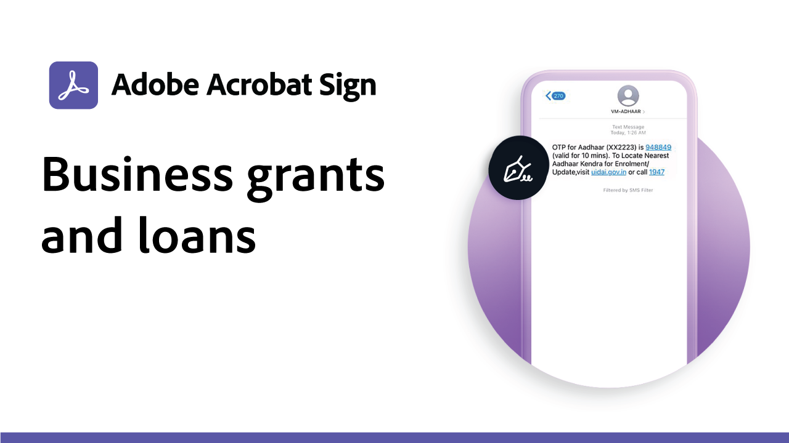

# Anwendungsfälle

In diesen Nutzungsszenarien erfahrt ihr, wie verschiedene Organisationen Acrobat Sign einsetzen, um die digitalen Workflows ihres Unternehmens zu transformieren.

## Neue Funktionen

* [Benutzerdefinierter Workflow für den IEP-Prozess für Bildungseinrichtungen](usecase-edu-iep.md)
Erfahren Sie, wie Sie mit der Designer für benutzerdefinierte Workflows einen IEP-Prozess (Individualized Education Program) digitalisieren
* [Praktikumsanwendung für Webformulare für Bildungseinrichtungen](usecase-edu-intern.md)
Erfahren Sie, wie Webformulare den Zugriff von Schülern auf erforderliche Formulare verbessern
* [Webformular-Praktikumsanwendung für Bildungseinrichtungen erstellen](usecase-edu-intern-create.md)
Erfahren Sie, wie Sie ein Webformular für ein Praktikum erstellen
* [Kreditantrag der Regierung mit mehreren unbekannten Unterzeichnern](webform-multiple-signers.md)
Erfahren Sie, wie ein Webformular für einen komplexen Arbeitsablauf für Bewerbungen mit öffentlichen Krediten verwendet wird, an dem mehrere unbekannte Teilnehmer beteiligt sind.

## Nutzungsszenarien in Regierungseinrichtungen

<table style="table-layout:fixed">
<tr>
  <td>
    
    

    <a href="webform-multiple-signers.md"><strong>Kreditantrag der Regierung mit mehreren unbekannten Unterzeichnern</strong></a>
    

    <em>Erfahren Sie, wie ein Webformular für einen komplexen Arbeitsablauf für die Darlehensanträge von Behörden verwendet wird, der mehrere unbekannte Teilnehmer umfasst</em>
    2 
  </td> 
  <td>
    
    

    <a href="usecasegovgrants.md"><strong>Unternehmenszuschüsse und -darlehen</strong></a>
    

    <em>Bieten Sie Unternehmen schnelle Unterstützung, indem Sie Self-Service-Zugriff auf Antragsformulare für Zuschüsse, Darlehen und Steueraufschub gewähren</em>
    2 
  </td> 
  <td>
    
    

    <a href="usecasegovtelework.md"><strong>Telearbeit-Vereinbarung</strong></a>
    

    <em>Effizientes Einholen von Unterschriften von allen Ihren Mitarbeitern für Telearbeit-Vereinbarungen, Richtlinienaktualisierungen und mehr</em>
    2 
  </td>
  <td>
    
    

    <a href="usecasegovcontracts.md"><strong>Verträge und Anforderungsformulare</strong></a>
    

    <em>Ersetzen Sie die Papierverarbeitung schnell durch standardkonforme digitale Workflows, komplett mit Audit-Berichten</em>
    2 
  </td>
</tr>
<tr>
 <td>
    
    

    <a href="usecasegovreemployment.md"><strong>Unterstützung bei der Wiederbeschäftigung</strong></a>
    

    <em>Helfen Sie Bürgern, die benötigte Hilfe zu erhalten, ohne mit Formularen für vollständig digitale Anwendungen in Einklang zu stehen, die in Tagen online gehen können</em>
    2 
  </td>
  <td>
    
    

    <a href="usecasegovpaycheck.md"><strong>Schutz für Gehaltsschecks</strong></a>
    

    <em>Erfahren Sie, wie Sie Acrobat Sign verwenden können, um das Formular für das Zahlungsschutzprogramm in ein interaktives Online-Formular zu konvertieren</em>
    2 
  </td>
  <td>
    
    

    <a href="usecasegovremote.md"><strong>Anforderung einer Remote-Garantie</strong></a>
    

    <em>Verwendet elektronische Unterschriften und Web-Konferenzen zusammen, um die Zeit für die Beantragung und den Schutz von Haftbefehlen von Richtern zu verkürzen</em>
    2 
  </td>
  <td>
    
    

     
  </td>
</tr>
</table>

## Gewerbliche Nutzungsszenarien

<table style="table-layout:fixed">
<tr>
  <td>
    
    

    <a href="usecasecomcontracts.md"><strong>Verträge und Anforderungsformulare</strong></a>
    

    <em>Ersetzen Sie die Papierverarbeitung schnell durch standardkonforme digitale Workflows, komplett mit Audit-Berichten</em>
    2 
  </td> 
  <td>
    
    

    <a href="usecasecompolicy.md"><strong>Richtlinienvereinbarungen</strong></a>
    

    <em>Effizientes Einholen von Signaturen von allen Ihren Mitarbeitern für Richtlinienvereinbarungen und Aktualisierungen</em>
    2 
  </td>
  <td>
    
    

    <a href="usecasecomtelework.md"><strong>Telearbeit-Vereinbarung</strong></a>
    

    <em>Effizientes Einholen von Unterschriften aller Ihrer Mitarbeiter für Telearbeit-Vereinbarungen</em>
    2 
  </td>
  <td>
    
    

     
  </td>
</tr>
</table>

## Nutzungsszenarien für Bildungseinrichtungen

<table style="table-layout:fixed">
<tr>
  <td>
    
    

    <a href="usecase-edu-intern.md"><strong>Praktikumsanwendung für Webformulare für Bildungseinrichtungen</strong></a>
    

    <em>Erfahren Sie, wie Webformulare verwendet werden, um den Zugriff der Schüler auf erforderliche Formulare zu verbessern</em>
    2 
  </td> 
  <td>
    
    

    <a href="usecase-edu-intern-create.md"><strong>Webformular-Praktikumsanwendung für Bildungseinrichtungen erstellen</strong></a>
    

    <em>Erfahren Sie, wie Sie ein Praktikums-Webformular erstellen</em>
    2 
  </td> 
  <td>
    
    

    <a href="usecase-edu-iep.md"><strong>Benutzerdefinierter Workflow für den IEP-Prozess für Bildungseinrichtungen</strong></a>
    

    <em>Erfahren Sie, wie die Designer für benutzerdefinierte Workflows verwendet wird, um einen IEP-Prozess (Individualized Education Program) zu digitalisieren</em>
    2 
  </td>
  <td>
    
    

     
  </td>
</tr>
</table>

