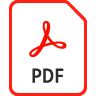

# Telearbeit-Vereinbarung mit Behörden

Erfahrt, wie ihr Unterschriften aller Mitarbeiter effizient einholt, etwa für Verträge im Homeoffice oder für Richtlinien-Updates. Als Erstes erstellst du eine wiederverwendbare Dokumentvorlage, auf die du über deine Dokumentenbibliothek schnell zugreifen kannst. Zweitens senden Sie die neue Dokumentvorlage mit Mega Sign zur Signatur an Hunderte von Mitarbeitern gleichzeitig.

>[!VIDEO](https://video.tv.adobe.com/v/33808?quality=12&learn=on&hidetitle=true)

Wählen Sie diese Option, um eine schrittweise PDF-Rezeptur für Telearbeit-Vereinbarungen herunterzuladen oder zu öffnen.

